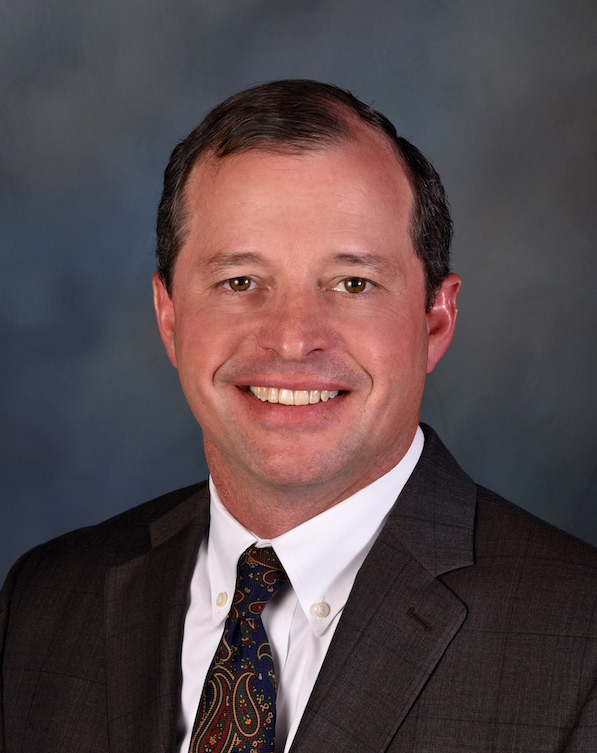

# <b>VERO Collaborators</b>
## (alphabetical order)
--------
### Keith E. Belk {:.invisible-header}

  

  
  <h2><b>Keith E. Belk, MS, PhD</b></h2>
    <h3>Professor and Ken & Myra Monfort Endowed Chair 
      Colorado State University</h3>
    
-- <a href="mailto:keith.belk@colostate.edu">keith.belk@colostate.edu</a>  
 

  

      
Keith Belk serves as Professor and Holder of the Monfort Endowed Chair, Center for Meat Safety & Quality, Colorado State University (CSU), and as an Adjunct Professor in the Colorado School of Public Health. Previously, he served as Professor and Head of the Department of Animal Sciences at CSU. He earned B.S. and M.S. degrees from CSU, and a Ph.D. from Texas A&M University. He has been employed in the private sector as a buyer by Safeway, Inc., and by the USDA Agricultural Marketing Service in Washington, DC, as an International Marketing Specialist. At CSU since 1995, he has authored or co-authored >260 refereed scientific journal articles, provided over 530 invited presentations, generated >$22M in extramural research funding, and was the primary inventor on two patents. He served as the state Meat Extension Specialist between 1995 and 2000, on the Editorial Board for the Journal of Animal Science in 1997-2000, on the Board of Directors for the American Meat Science Association (AMSA) between 2003-2005, and as President of AMSA in 2009-2010.

    

--------
### Tony C. Bryant {:.invisible-header}

  

  
  <h2><b>Tony C. Bryant, MS, PhD</b></h2>
    <h3>Director of Nutrition, Research, and Analytics 
    Five Rivers Cattle Feeding</h3>
    
-- <a href="mailto:tony.bryant@5rcattle.com">tony.bryant@5rcattle.com</a>  
 

  

      
Tony was born and raised in Amarillo, Texas.  While growing up, he worked on the family feedlot and farm in the Texas Panhandle and the family cow-calf and stocker ranch in Oklahoma.  Tony received a B.S. in Agribusiness and M.S. in Ruminant Nutrition from West Texas A&M University.  Tony then completed his Ph.D. at Colorado State University in Ruminant Nutrition and Metabolic Physiology. Tony has worked for Five Rivers Cattle Feeding since 1998 and has held various roles.  Tony is currently the Director of Nutrition, Research, and Analytics in which he manages and coordinates the nutrition and research functions for the company overseeing the nutrition program and conducting research trials in the areas of nutrition, growth, and health.  Although his role is in the private sector, Tony has published 25 peer-reviewed publications and over 100 internal research trial publications.  Tony is active in many industry organizations and advisory boards including the National Cattlemen’s Beef Association, Texas Cattle Feeders Association, Plains Nutrition Council, and Beef Industry Food Safety Council. Tony and his wife Megan and son Aidan live in Windsor, Colorado.

    

--------
### Ty E. Lawrence {:.invisible-header}

  

  
  <h2><b>Ty E. Lawrence, MS, PhD</b></h2>
    <h3>Professor and Caviness Davis Distinguished Chair in Meat Science 
      Director, Beef Carcass Research Center 
      West Texas A&M University</h3>
    
-- <a href="mailto:tlawrence@wtamu.edu">tlawrence@wtamu.edu</a>  
 

  

      
Ty E. Lawrence is a professor of animal science at West Texas A&M University.  He was raised on a cow-calf operation near Dalhart, Texas before pursuing formal education at West Texas A&M University (B.S., M.S.) and Kansas State University (Ph.D.).  Dr. Lawrence spent 2 years with Smithfield in the position of research manager for pork harvest and processing facilities on the eastern seaboard before entering his academic career.  In his current position at West Texas A&M University, he has taught over 2,500 undergraduate and graduate students in 14 different animal, food and meat science courses.  He has advised 5 Ph.D. and 37 M.S. students.  In addition, Dr. Lawrence is the Director of the WTAMU – Beef Carcass Research Center, which annually evaluates 200,000+ cattle for a variety of research projects.  His research activities focus on improving the yield, quality, and safety of red meat products and have resulted in the publication of more than 100 peer-reviewed scientific journal manuscripts.  Dr. Lawrence has received the AMSA Distinguished Achievement Award and the Distinguished Extension-Industry Award, was a recipient of the inaugural 40 under 40 awards in Agriculture from the Vance Publishing Group, and holds the Caviness Davis Distinguished Chair in Meat Science.

    

--------
### Noelle R. Noyes {:.invisible-header}
--------
### Annette M. O'Connor {:.invisible-header}

  

  
  <h2><b>Annette M. O'Connor, BVSc, MVSc, DVSc, FANZCVS</b></h2>
    <h3>Professor of Epidemiology and Chairperson 
      Department of Large Animal Clinical Sciences 
      Michigan State University</h3>
    
-- <a href="mailto:oconn445@msu.edu">oconn445@msu.edu</a>  
 

  

      
Dr. O’Connor is a veterinarian and quantitative epidemiologist interested in applying quantitative epidemiology to better inform policy related to food safety, one health, animal welfare, animal health, and veterinary clinical practice. Dr. O’Connor has been a leader in veterinary science to translate research into practice by reducing research wastage and maximizing the value of research. Dr. O’Connor works extensively with the livestock industries to utilize technology and research to improve production, animal welfare, and sustainability. Dr. O’Connor has been instrumental in developing and applying research synthesis methods, including network-meta-analysis in veterinary science. Dr. O’Connor co-lead the REFLECT statement and Vet-STROBE statement initiatives designed to improve the reproducibility and utility of veterinary research. She also co-leads the MERIDIAN initiatives (http://meridian.cvm.iastate.edu ), which seeks to improve the reporting of all research involving animals and the SYREAF website (Systematic Reviews of Animals and Food - www.Syreaf.com), which provides unique information for researchers seeking to conduct systematic reviews. These initiatives have required international collaborations and have had an international impact on reporting in veterinary science. Dr. O’Connor is the author of over 170 peer-reviewed manuscripts and has been invited to present at numerous producer and researcher meetings and numerous workshops on systematic reviews and meta-analysis, both National and International, for groups such as the European Food Safety Authority and the Food and Drug Administration. Dr. O’Connor also works to democratize access to science with strong support for the Open Science movement.  Within the workplace of the university community and the academy, Dr. O’Connor also seeks to ensure that the advantages of education and the academy are accessible to all members of society by learning how she can contribute to a community where diversity informs our everyday thought process and decision making.

  

--------
### John L. Pipkin {:.invisible-header}
  

  

  
  <h2><b>John L. Pipkin, MS, PhD</b></h2>
    <h3>Regents Professor & Engler Professor of Animal Science 
      Director of Equine Programs 
      West Texas A&M University</h3>
    
-- <a href="mailto:jpipkin@wtamu.edu">jpipkin@wtamu.edu</a>  
 

  

      
John Pipkin is currently the Director of the Equine Industry Program, and a Regents Professor and Engler Professor of Animal Science at West Texas A&M University.  His instructional duties have included Reproductive Physiology, graduate Endocrinology, portions of Anatomy and Physiology, Professional Leadership, and Selection and Evaluation.  As Equine Program Director, he oversees the teaching, research, and service duties related to the Equine Program, and Faculty Supervisor of the WT Horse Center.  He also coaches the Horse Judging Team, and oversees the Judging and Equestrian Teams. He has been an approved horse show judge for over 30 years for multiple associations, and has judged over 500 total shows in 13 different countries, and over 20 World Championships. Pipkin’s judging teams have won 160 National or World Champion or Reserve Champion titles; and Equestrian and Ranch Teams under his program direction have won over 60 National Champion or Reserve Champion titles.  He trained and showed horses professionally in many disciplines. Pipkin works closely with several Equine and Breed Associations where he works with various committees.  He is a National Director for AQHA, has served as Chairman of the AQHA Judges Committees, AQHA Show and Professional Horsemen Committee, and the AQHA Show Council. Dr. Pipkin has been awarded the Outstanding Young Professional Award by the Equine Science Society, Texas 4-H Alumni Award, and the 2023 AQHA Don Burt Professional Horseman of the Year. At WT, he has received the Magister Optimus award, the university’s highest faculty recognition, and University Teaching Excellence award. The Texas A&M University System awarded him the Teaching Excellence Award, and named him a Regents Professor. In addition, he has received numerous Texas A&M System Regent’s resolutions and WT President’s Silver Buffalo awards; was inducted into the Texas Tech Department of Animal & Food Sciences Hall of Fame; and has over 200 publications, given over 100 invited professional presentations, chaired or been a member of over 75 graduate student committees, and secured over $5.8 million in donations, grants, and gifts.

  

--------
### John T. Richeson {:.invisible-header}

  

  
  <h2><b>John T. Richeson, MS, PhD</b></h2>
    <h3>Paul Engler Professor of Beef Cattle Feedlot Management 
    West Texas A&M University</h3>
    
-- <a href="mailto:jricheson@wtamu.edu">jricheson@wtamu.edu</a>  
 

  

      
Dr. John Richeson is the Paul Engler Professor of Beef Cattle Feedlot Management and faculty supervisor of the Research Feedlot at West Texas A&M University. John currently teaches several undergraduate and graduate courses, serves on numerous University committees, is Graduate Coordinator for the Department of Agricultural Sciences, and is an advisory board member of four different industry organizations. He received his BS, MS, and PhD in Animal Science from Oklahoma State University (2000), Texas Tech University (2004), and University of Arkansas (2011), respectively. Between his academic pursuits, John was employed by a major cattle feeding company in Colorado after earning his BS, and the University of Arkansas Division of Agriculture Cooperative Extension Service after completing his MS degree. Research interests include evaluating management, nutritional, and immunological manipulations to improve the welfare, health and growth of stocker and feedlot cattle. Additional research efforts have focused on evaluation of biomarker and behavior technology to assist in the prediction and early detection of bovine respiratory disease. Delayed vaccination and targeted metaphylaxis are important concepts within the beef production system that John and his colleagues and students’ research have facilitated. John has advised or co-advised 28 MS and PhD graduate students and is especially fond of the relationships built with both students and collaborators since becoming an Assistant Professor in 2011. John has published over 100 referred abstracts, 67 peer-reviewed journal articles, and 4 review manuscripts. He is a member of American Society of Animal Science and the American Registry of Professional Animal Scientists, and has served on the ASAS southern section Graduate Student Paper competition committee, the Editorial Board for Applied Animal Scientist, and serves as Director for the Professional Animal Auditor Certification Organization.

    

--------
### Ben Weinheimer {:.invisible-header}

  

  
  <h2><b>Ben Weinheimer, MS</b></h2>
    <h3>President & CEO 
      Texas Cattle Feeders Association</h3>
    
-- <a href="mailto:ben@tcfa.org">ben@tcfa.org</a>  
 

  

      
Ben Weinheimer is president & CEO of the Texas Cattle Feeders Association (TCFA),
headquartered in Amarillo, Texas. He was named to that position in 2022, and has been on staff
since 1995, serving previously as vice president from 2006-2021 and as regulatory manager
from 1995-2005.  As president & CEO, Weinheimer is responsible for day-to-day operations of theAssociation, including supervising implementation of policy at the state and federal legislative
and regulatory levels, as well as the association’s programs and services offered to members in
Texas, Oklahoma and New Mexico. Weinheimer is active in several industry-related and civic organizations and currently
serves as Chairman of the Panhandle Regional Water Planning Group, member of the Llano
Estacado Regional Water Planning Group, past chairman of the U.S. Roundtable for
Sustainable Beef, past president of the Texas Agricultural Lifetime Leadership Alumni
Association, past president of the Texas Section of the American Society of Agricultural
Engineers, member of the National Cattlemen’s Beef Association, member of the Texas
Association of Community Colleges Business Advisory Council, and member of the Texas A&M
University – Veterinarian, Education, Research and Outreach Advisory Council.
Weinheimer grew up on a diversified crop and livestock operation in the Texas
Panhandle. He is a honors graduate of Texas A&M University with a degree in agricultural
engineering and is a licensed professional engineer in Texas, New Mexico and Oklahoma.
Ben and wife, Jennifer, reside in Amarillo, Texas. They are proud parents of a daughter
and two sons and grandparents of four amazing grandchildren.

    

--------
##
# 
