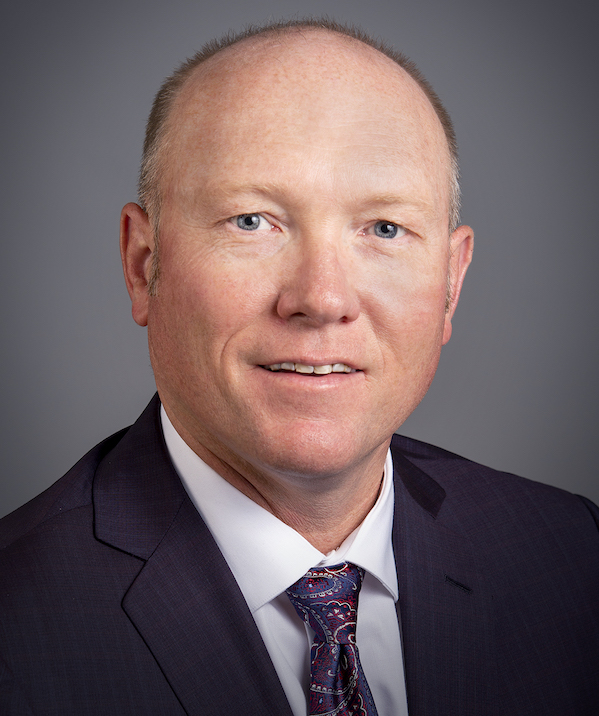
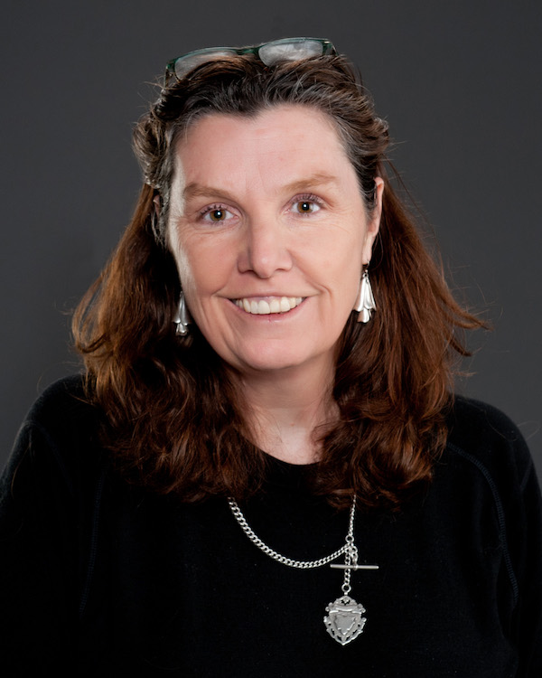

# <b>VERO Collaborators</b>
## (alphabetical order)
--------
### Keith E. Belk {:.invisible-header}

  

  
  <h2><b>Keith E. Belk, MS, PhD</b></h2>
    <h3>Professor and Ken & Myra Monfort Endowed Chair 
      Colorado State University</h3>
    
-- <a href="mailto:keith.belk@colostate.edu">keith.belk@colostate.edu</a>  
 

  

      
Keith Belk serves as Professor and Holder of the Monfort Endowed Chair, Center for Meat Safety & Quality, Colorado State University (CSU), and as an Adjunct Professor in the Colorado School of Public Health. Previously, he served as Professor and Head of the Department of Animal Sciences at CSU. He earned B.S. and M.S. degrees from CSU, and a Ph.D. from Texas A&M University. He has been employed in the private sector as a buyer by Safeway, Inc., and by the USDA Agricultural Marketing Service in Washington, DC, as an International Marketing Specialist. At CSU since 1995, he has authored or co-authored >260 refereed scientific journal articles, provided over 530 invited presentations, generated >$22M in extramural research funding, and was the primary inventor on two patents. He served as the state Meat Extension Specialist between 1995 and 2000, on the Editorial Board for the Journal of Animal Science in 1997-2000, on the Board of Directors for the American Meat Science Association (AMSA) between 2003-2005, and as President of AMSA in 2009-2010.

    

--------
### Ty E. Lawrence {:.invisible-header}

  

  
  <h2><b>Ty E. Lawrence, MS, PhD</b></h2>
    <h3>Professor, West Texas A&M University</h3>
    
-- <a href="mailto:tlawrence@wtamu.edu">tlawrence@wtamu.edu</a>  
 

  

      
Ty E. Lawrence is a professor of animal science at West Texas A&M University.  He was raised on a cow-calf operation near Dalhart, Texas before pursuing formal education at West Texas A&M University (B.S., M.S.) and Kansas State University (Ph.D.).  Dr. Lawrence spent 2 years with Smithfield in the position of research manager for pork harvest and processing facilities on the eastern seaboard before entering his academic career.  In his current position at West Texas A&M University, he has taught over 2,500 undergraduate and graduate students in 14 different animal, food and meat science courses.  He has advised 5 Ph.D. and 37 M.S. students.  In addition, Dr. Lawrence is the Director of the WTAMU – Beef Carcass Research Center, which annually evaluates 200,000+ cattle for a variety of research projects.  His research activities focus on improving the yield, quality, and safety of red meat products and have resulted in the publication of more than 100 peer-reviewed scientific journal manuscripts.  Dr. Lawrence has received the AMSA Distinguished Achievement Award and the Distinguished Extension-Industry Award, was a recipient of the inaugural 40 under 40 awards in Agriculture from the Vance Publishing Group, and holds the Caviness Davis Distinguished Chair in Meat Science.

    

--------
### Noelle R. Noyes {:.invisible-header}
--------
### Annette M. O'Connor {:.invisible-header}

  

  
  <h2><b>Annette M. O'Connor, BVSc, MVSc, DVSc, FANZCVS</b></h2>
    <h3>Professor of Epidemiology and Chairperson 
      Department of Large Animal Clinical Sciences 
      Michigan State University</h3>
    
-- <a href="mailto:oconn445@msu.edu">oconn445@msu.edu</a>  
 

  

      
Dr. O’Connor is a veterinarian and quantitative epidemiologist interested in applying quantitative epidemiology to better inform policy related to food safety, one health, animal welfare, animal health, and veterinary clinical practice. Dr. O’Connor has been a leader in veterinary science to translate research into practice by reducing research wastage and maximizing the value of research. Dr. O’Connor works extensively with the livestock industries to utilize technology and research to improve production, animal welfare, and sustainability. Dr. O’Connor has been instrumental in developing and applying research synthesis methods, including network-meta-analysis in veterinary science. Dr. O’Connor co-lead the REFLECT statement and Vet-STROBE statement initiatives designed to improve the reproducibility and utility of veterinary research. She also co-leads the MERIDIAN initiatives (http://meridian.cvm.iastate.edu ), which seeks to improve the reporting of all research involving animals and the SYREAF website (Systematic Reviews of Animals and Food - www.Syreaf.com), which provides unique information for researchers seeking to conduct systematic reviews. These initiatives have required international collaborations and have had an international impact on reporting in veterinary science. Dr. O’Connor is the author of over 170 peer-reviewed manuscripts and has been invited to present at numerous producer and researcher meetings and numerous workshops on systematic reviews and meta-analysis, both National and International, for groups such as the European Food Safety Authority and the Food and Drug Administration. Dr. O’Connor also works to democratize access to science with strong support for the Open Science movement.  Within the workplace of the university community and the academy, Dr. O’Connor also seeks to ensure that the advantages of education and the academy are accessible to all members of society by learning how she can contribute to a community where diversity informs our everyday thought process and decision making.

  

--------
### John L. Pipkin {:.invisible-header}
--------
### John T. Richeson {:.invisible-header}
--------
### Amelia R. Woolums {:.invisible-header}

# 
