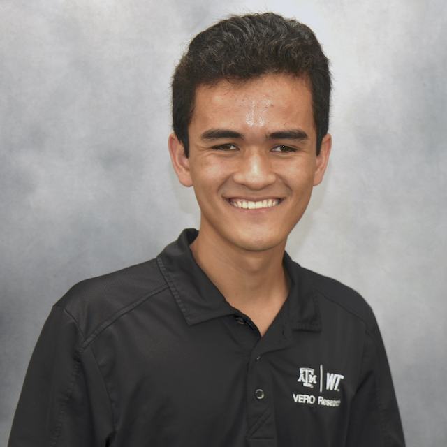
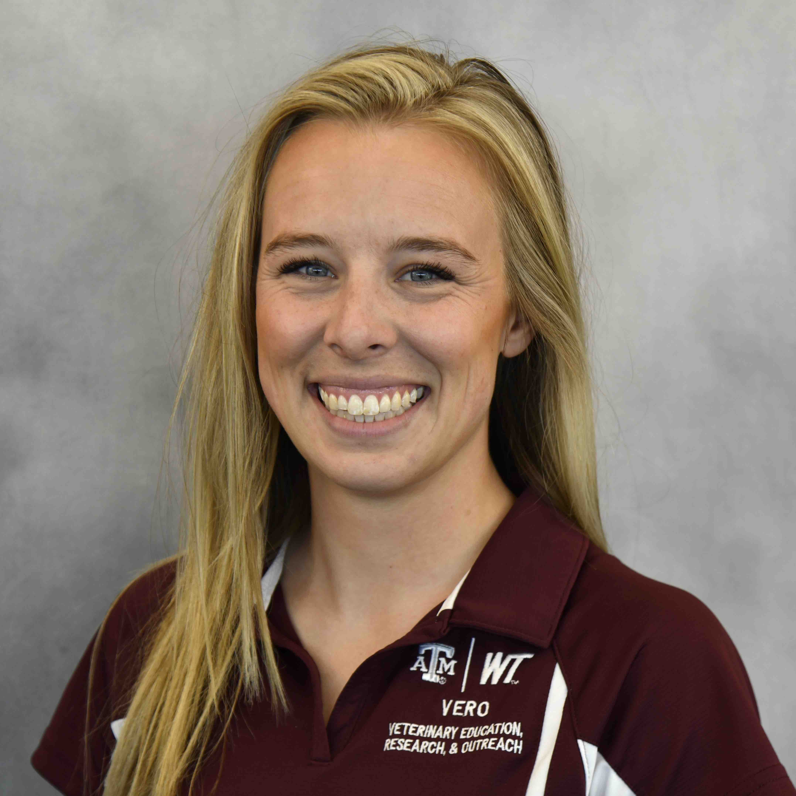
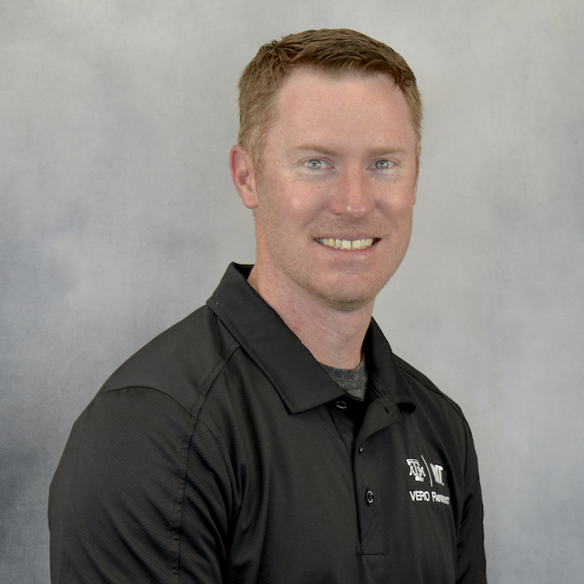

# Former VERO Team Members

### Bigelow, Rebecca  {:.invisible-header}

  

    
  

  

    <h2>Rebecca Bigelow, MS</h2>
    <h3>MS graduate</h3>
    
rabigelow1@buffs.wtamu.edu

  

  

    
Rebecca received her BS in Biomedical Sciences from Texas A&M University and her MS degree 2023 from the Department of Agricultural Sciences at West Texas A&M and the VERO Partnership. Her research focused on evaluating effects of various antimicrobials on the whole blood transcriptome of commercial feedlot cattle when administered as a metaphylactic treatment for bovine respiratory disease. Rebecca is currently pursuing her PhD at Kansas State University. 

  

--------
### Chung, Max  {:.invisible-header}

  

    
  

  

    <h2>Max Chung</h2>
    <h3>-- MS Student, Texas A&M University 
    -- Advisor: Dr. Robert Valeris-Chacin</h3>
    
-- <a href="mailto:chunmn26@tamu.edu">chunmn26@tamu.edu</a> 
  

  

    
Max received his BS in Biology from the University of Wisconsin - Green Bay in 2021. He joined Dr. Valeris’s lab in 2022 and is was a Masters - Thesis student in the Biomedical Sciences (BIMS) program. Max’s research focused on identifying virulence factors and antimicrobial resistance genes in <i>Salmonella</i> isolates from beef cattle in the Texas panhandle. By comparing the distribution of these pathogenicity-relevant genes among isolates, Max will advance the current knowledge on Salmonella ecology in cattle and significantly improve industry understanding of <i>Salmonella</i> capabilities to cause harm.

  

--------
### Green, Mollie  {:.invisible-header}

  

    
  

  

    <h2>Mollie Green, MS</h2>
    <h3>MS graduate</h3>
    
mmgreen2@buffs.wtamu.edu

  

  

    
Mollie received her Bachelor of Science degree from West Texas A&M University and her MS degree in 2023 from West Texas A&M University and the VERO Partnership. Her graduate research focuses on the overall use of genetic and genomic technologies for beef cattle systems for beef cattle health improvement. As Mollie continues her research in this field, she aims to support industry leaders with information that can be used to improve decision making in areas such as cattle health, production efficiency, and global sustainability.

  

--------

###  McAtee, Taylor

  

    
  

  

    <h2>Taylor McAtee, MS</h2>
    <h3>MS graduate</h3>
    
taylormcatee@vet.k-state.edu

  

  

    
Taylor received her MS degree in Animal Science from West Texas A&M University in 2022. She evaluated the impact of different adminstration routes of respiratory vaccinations on the respiratory microbiome of high-risk feedlot cattle. She is currently a PhD student at Kansas State University studying commercial beef production systems to enable science-based management decisions.

  

-------
### Murphy, Maggie  {:.invisible-header}

  

    
  

  

    <h2>Maggie Murphy</h2>
    <h3>-- PhD Student, West Texas A&M University 
    -- Advisors: Dr. Paul Morley and Dr. John Pipkin</h3>
    
-- <a href="mailto:mmurphy@wtamu.edu">mmurphy@wtamu.edu</a> 
  

  

    
Maggie grew up in Peyton, Colorado before moving to Canyon, TX to pursue her B.S. in Equine Industry and Business at West Texas A&M University.  following this, Maggie also pursued her M.S. in Animal Science at WT working under Dr. Lance Baker and Dr. John Pipkin, researching voluntary dry matter intake of equines being fed a functional feed additive.  Currently, Maggie is working under Dr. Paul Morley on her Ph.D. in systems Agriculture through WTAMU.  Her research focuses on characterizing the developing microbiomes and resisitomes in young dairy cattle and young horses.  In her spare time, she enjoys horseback riding and spending time with her border collie. ....

  

    

-------
### Tamm, Stephen  {:.invisible-header}

  

    
  

  

    <h2>Stephen Tamm, MS</h2>
    <h3>-- MS Student 
    -- Advisor: Dr. Paul Morley</h3>
    
-- <a href="mailto:sctamm@tamu.edu">sctamm@tamu.edu</a> 
   -- <a href="https://www.ncbi.nlm.nih.gov/myncbi/1jmFD_nAPdeE_a/bibliography/public/">PubMed bibliography link</a> 
  

  

    
Stephen completed undergraduate studies in animal science at West Texas A&M University in 2012 and immediately began work in animal nutrition and feedlot services throughout Texas, New Mexico, Kansas, and Oklahoma.  He later relocated to Idaho to expand his education and received his MS from the University of Idaho in 2018.  His research at UI was focused on cell signaling and bovine skeletal muscle satellite cell behavior.  Stephen also held a teaching assistantship and advised pre-veterinary undergraduate students while at UI.  His current interests include physiological mechanisms in agricultural production systems, microbiome dynamics and anatomical axes, and epidemiological perspectives on sustainable agriculture.  He joined #TeamVERO in 2022 and is conducting research focused on pathogen monitoring in beef production systems, microbial predictors of animal health, and antimicrobial resistance dynamics in large animals.

  

    

-------
### Young, James Daniel  {:.invisible-header}

  

    
  

  

    <h2>James Daniel Young, MS</h2>
    <h3>-- PhD Student, West Texas A&M University 
    -- Advisors: Dr. Paul Morley and Dr. John Richeson</h3>
    
-- <a href="mailto:jdyoung3@buffs.wtamu.edu">jdyoung3@buffs.wtamu.edu</a> 
    -- <a href="https://www.ncbi.nlm.nih.gov/myncbi/james.young.6/bibliography/public/">PubMed bibliography link</a>

  

  

    
Daniel received his MS degree from Texas Tech University in 2022 and his PhD from West Texas A&M University in 2024. Daniel’s doctoral research was focused on gastrointestinal health of feedlot cattle. More specifically his research focused on the interaction between the animal and gut microbiota. Daniel’s work aimed to connect gastrointestinal health to complex diseases like liver abscesses, to better understand the pathogenesis and mitigation strategies of these diseases.

  

    

-------

