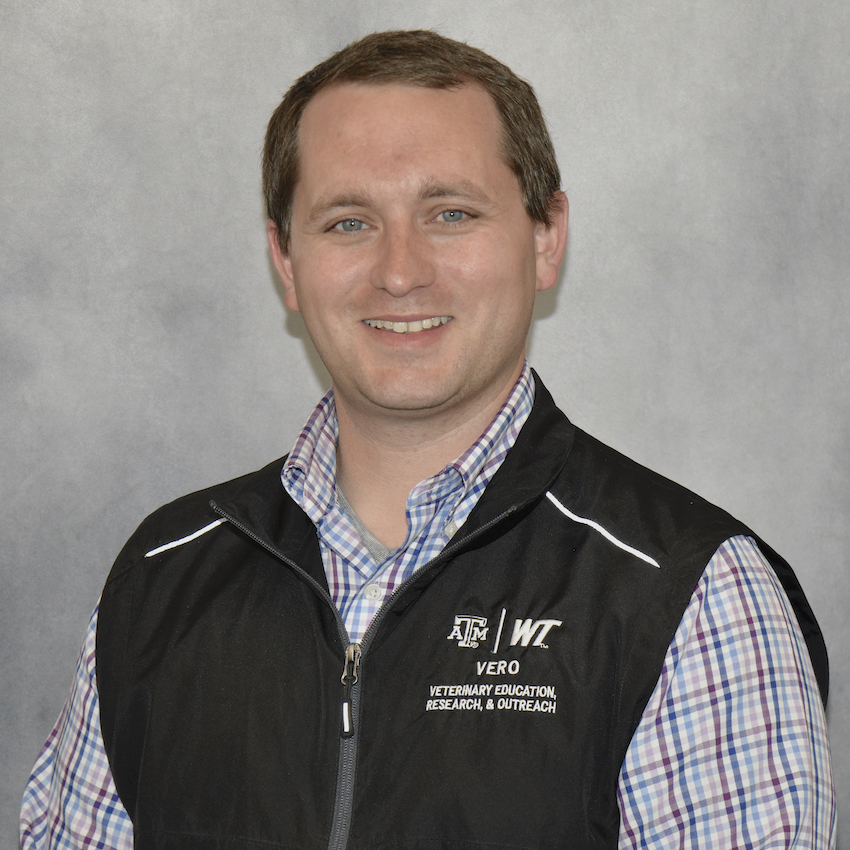

# VERO Faculty and postdoctoral researchers

### Morley, Paul  {:.invisible-header}

  

    
  

  

    <a href="../people/morley"><h2>Dr. Paul Morley</h2></a>
    <h3>Director of Food Animal Research & Professor (VLCS – VERO)</h3>
  

  

    
Dr. Paul Morley is a professor and director of food animal research for #TeamVERO through the Department of Large Animal Clinical Sciences (VLCS) in the CVMBS. He is an epidemiologist and veterinary internal medicine specialist who studies infectious diseases affecting people and animals. Major emphases for his professional activities include investigating the ecology of antimicrobial resistance in animals and food production systems, using analytical epidemiology to improve our understanding of diseases in animals and people, and improving infection control and biosecurity to manage health risks that are important in veterinary medicine, agriculture, and public health. His research has used shotgun metagenomics to investigate the influence of production practices in intensive agriculture systems on antimicrobial resistance and microbial ecology as these affect human, animal, and ecosystem health.

  

--------

### Valeris-Chacin, Robert {:.invisible-header}

  

    
  

  

    <a href="../people/valeris"><h2>Dr. Robert Valeris-Chacin</h2></a>
    <h3> Assistant Professor in Food Animal Epidemiology at Texas A&M University</h3>
  

  

    
I am an epidemiologist interested in the use of antibiotic alternatives for the prevention and control of infectious diseases in food animal production systems, such as bovine respiratory disease in beef and dairy cattle.

  

--------

### Scott, Matthew  {:.invisible-header}

  

    
  

  

    <a href="../people/scott"><h2>Dr. Matthew A. Scott</h2></a>
    <h3> Assistant Professor of Microbial Ecology & Infectious Disease (VLCS – VERO)</h3>
  

  

    
Dr. Matthew Scott is an assistant professor for #TeamVERO through the Department of Large Animal Clinical Sciences (VLCS) within the School of Veterinary Medicine and Biomedical Sciences (SVMBS). Before joining #TeamVERO in the summer of 2021, he received his DVM in 2018 and a PhD in Veterinary Medical Science – Infectious Diseases in 2021, both from Mississippi State University. Much of his research and professional activities relate to investigating the relationships between host immunity, microbial ecosystems, and cattle management programs, centered on clinical bovine respiratory disease (BRD). These activities are in the aim to develop pipelines and tools that would mitigate risk of disease in food production settings, such as feedlots.

  

--------

### Pinnell, Lee  {:.invisible-header}

  

    
  

  

    <a href="../people/pinnell"><h2>Dr. Lee J. Pinnell</h2></a>
    <h3> Research Assistant Professor of Microbial Ecology </h3>
  

  

    
Dr. Lee Pinnell is a research assistant professor with VERO through the Department of Large Animal Clinical Sciences (VLCS). Prior to joining VLCS, he received his PhD in marine biology from Texas A&M University-Corpus Christi and his MSc from the University of Waterloo in Waterloo, Ontario. After his PhD, he was a Postdoctoral Scientist with the Molecular and Microbial Ecology Group at the John G. Shedd Aquarium in Chicago. His research aims to protect and improve animal and ecosystem health through the exploration of microbial interactions in the Anthropocene. The majority of his research explores the ecology of pathogens and antimicrobial resistance in agricultural systems, the impact of anthropogenic stressors on microbial processes, and host-microbe relationships in managed/built environments.

  

--------

### Doster, Enrique  {:.invisible-header}

  

    
  

  

    <h2>Enrique Doster, DVM, PhD</h2>
    <h3>Postdoctoral research associate</h3>
    
enriquedoster@tamu.edu

    
<a href="https://www.ncbi.nlm.nih.gov/myncbi/enrique.doster.1/bibliography/public/">PubMed bibliography link</a>

    
<a href="https://scholar.google.com/citations?view_op=list_works&hl=en&user=DRqM0WoAAAAJ&gmla=AHoSzlU0OTbYVbdQd7AI9w-y74tNnZLbwxJa_t568iQy6zu8FvFBWpDbaKNzlsIe_OVAyuGjodfbfVb3jin-UvCr0NqyLiRn5ns-V1Kmh18pQg">Google Scholar link</a>

  

  

    

    Enrique is a postdoctoral researcher working with Dr. Paul Morley and the VERO team at West Texas A&M University. Enrique received his veterinary degree in May 2022 from the Colorado State University College of Veterinary Medicine and Biomedical Sciences. At the same institution, Enrique completed his PhD in veterinary epidemiology in May 2019 with Dr. Paul Morley. Enrique holds a bachelor’s degree in Animal Sciences from Auburn University. Enrique's research employs high-throughput sequencing to characterize microbial communities (the microbiome) and the profile of resistance genes they carry (resistome) to better understand the effect of antimicrobial drug use in agricultural production settings. His goal is to contribute an applied interpretation of statistical analyses and help translate research into practical livestock management techniques to address the tenets of One Health; optimal health for people, animals, and the environment. 
    

  

