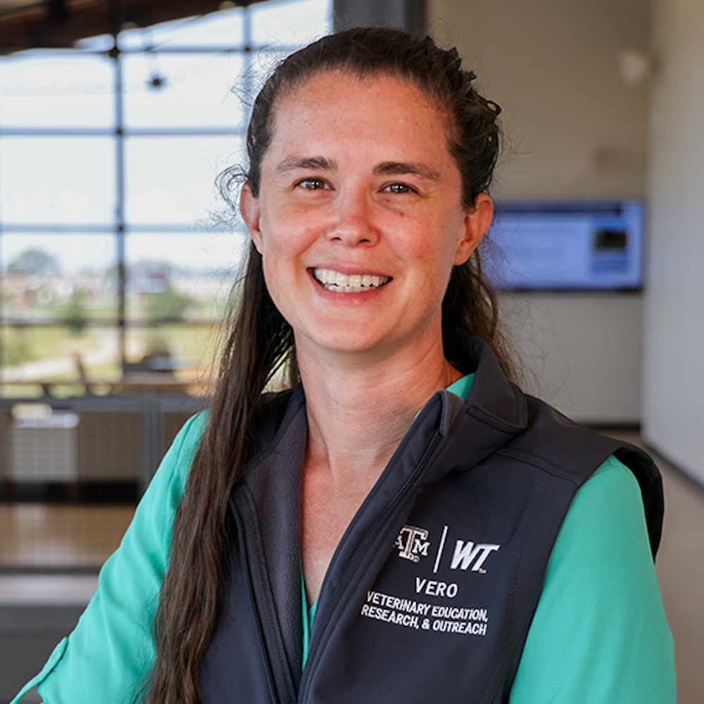
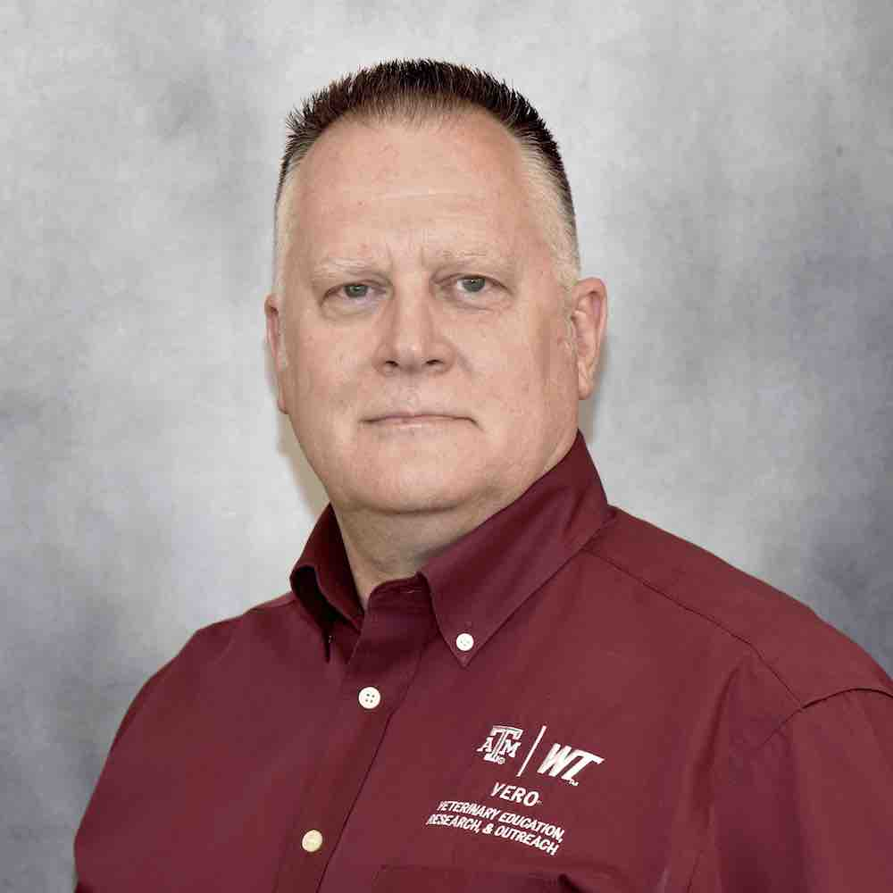
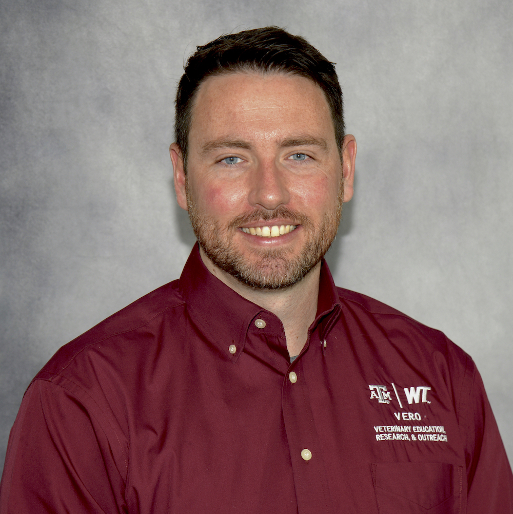
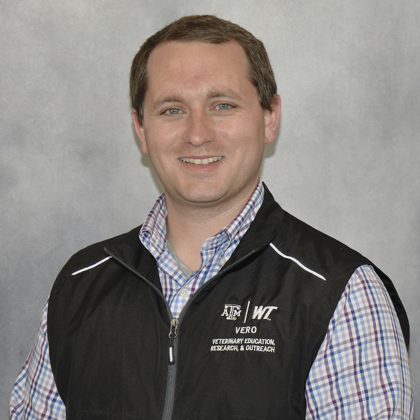
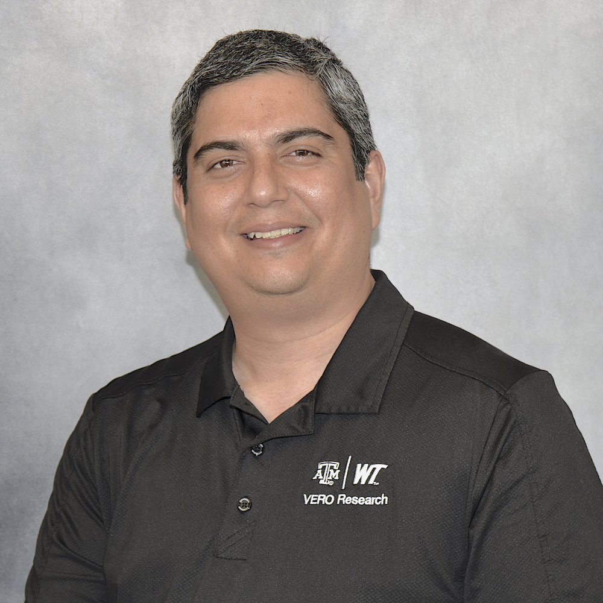
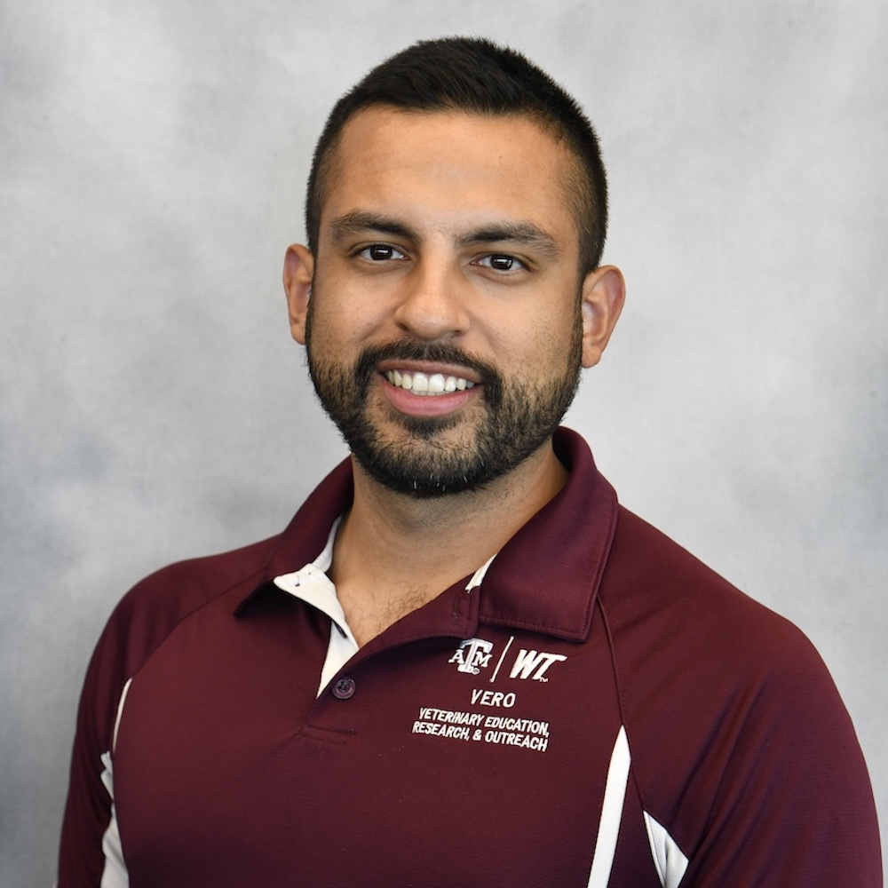

<h1><strong>VERO Faculty and Post-Doctoral Researchers</strong></h1>

<!-- ───────────── 1. Kendall Langsten  ───────────── -->

  

    <h2><a href="../people/langsten">Kendall Langsten, DVM, PhD </a></h2>
    <h3>Professor &amp; Clinical Assistant Professor</h3>
    

      <a href="mailto:klangsten@tamu.edu">klangsten@tamu.edu</a> 
      <a href="https://www.ncbi.nlm.nih.gov/myncbi/127TeRiI5VYglH/bibliography/public/">PubMed bibliography</a> 
      <a href="https://https://scholar.google.com/citations?hl=en&user=0j7dstAAAAAJ&view_op=list_works&sortby=pubdate?
        

  

    
  

<!-- ───────────── 2. Paul S. Morley ───────────── -->
### Morley, Paul  {:.invisible-header}

  

    <h2><a href="../people/morley">Paul S. Morley, DVM, PhD, DACVIM</a></h2>
    <h3>Professor &amp; Director of Research Sally Rau McIntosh Endowed Chair</h3>
    

      <a href="mailto:pmorley@tamu.edu">pmorley@tamu.edu</a> 
      <a href="https://www.ncbi.nlm.nih.gov/myncbi/14Ikqzq30Nv5a/bibliography/public/">PubMed bibliography</a> 
      <a href="https://scholar.google.com/citations?user=T-yNyx0AAAAJ&hl=en">Google Scholar</a> 
      <a href="https://github.com/Microbial-Ecology-Group">GitHub</a>
    

  

  

    
  

<!-- ───────────── 3. Lee J. Pinnell ───────────── -->
### Pinnell, Lee  {:.invisible-header}

  

    <h2><a href="../people/pinnell">Lee J. Pinnell, MS, PhD</a></h2>
    <h3>Research Assistant Professor of Microbial Ecology</h3>
    

      <a href="mailto:ljpinnell@tamu.edu">ljpinnell@tamu.edu</a> 
      <a href="https://pubmed.ncbi.nlm.nih.gov/?term=Pinnell+LJ">PubMed bibliography</a> 
      <a href="https://scholar.google.com/citations?user=5AFfRq4AAAAJ">Google Scholar</a> 
      <a href="https://github.com/ljpinnell">GitHub</a>
    

  

  

    
  

<!-- ───────────── 4. Matthew A. Scott ───────────── -->
### Scott, Matthew  {:.invisible-header}

  

    <h2><a href="../people/scott">Matthew A. Scott, DVM, PhD</a></h2>
    <h3>Assistant Professor of Microbial Ecology &amp; Infectious Disease</h3>
    

      <a href="mailto:mascott@tamu.edu">mascott@tamu.edu</a> 
      <a href="https://www.ncbi.nlm.nih.gov/myncbi/1V5hGBqnfdQEja/bibliography/public/">PubMed bibliography</a> 
      <a href="https://scholar.google.com/citations?user=P2Mfcf8AAAAJ">Google Scholar</a>
    

  

  

    
  

<!-- ───────────── 5. Robert Valeris-Chacin ───────────── -->
### Valeris-Chacin, Robert {:.invisible-header} 

  

    <h2><a href="../people/valeris">Robert Valeris-Chacin, DVM, MS, PhD</a></h2>
    <h3>Assistant Professor of Food-Animal Epidemiology</h3>
    

      <a href="mailto:robertv@tamu.edu">robertv@tamu.edu</a> 
      <a href="https://pubmed.ncbi.nlm.nih.gov/?term=Valeris-Chacin+R">PubMed bibliography</a> 
      <a href="https://scholar.google.com/citations?user=5AFfRq4AAAAJ">Google Scholar</a>
    

  

  

    
  

<!-- ───────────── 6. Sarobi Das ───────────── -->
### Das, Sarobi {:.invisible-header}

  

    
     

  

    <h2>Sarobi Das, PhD</h2>
    <h3>Post-Doctoral Research Associate</h3>
      
<a href="mailto:sarobi.das@tamu.edu">sarobi.das@tamu.edu</a> 
  

    
 I am a Postdoctoral Research Associate at VERO, working in Dr. Paul Morley’s lab. I completed my PhD in Quantitative Biology from the University of Texas at Arlington. I pursued my Master of Science degree in Botany from the University of Kalyani (West Bengal, India), followed by a Master of Technology degree in Agricultural Systems and Management from the Indian Institute of Technology Kharagpur (IIT Kharagpur, India).

  

    

<!-- ───────────── 7. Enrique Doster ───────────── -->
### Doster, Enrique  {:.invisible-header}

  

    <h2><a href="../people/doster">Enrique Doster, DVM, PhD</a></h2>
    <h3>Post-Doctoral Research Associate</h3>
    

      <a href="mailto:enriquedoster@tamu.edu">enriquedoster@tamu.edu</a> 
      <a href="https://www.ncbi.nlm.nih.gov/myncbi/enrique.doster.1/bibliography/public/">PubMed bibliography</a> 
      <a href="https://scholar.google.com/citations?user=DRqM0WoAAAAJ">Google Scholar</a> 
      <a href="https://github.com/EnriqueDoster">GitHub</a>
    

  

  

    
  

