----
template: people.html
title: People 
---
# <b>Students and Staff</b>
## (alphabetical order)
--------
### Bishop, Rachel  {:.invisible-header}

  

    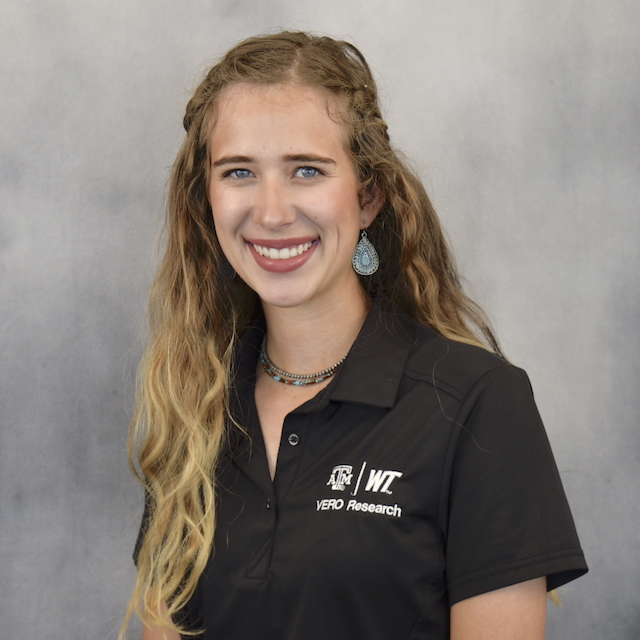
  

  

    <h2>Rachel Bishop</h2>
    <h3>-- Research Assistant</h3>
    
-- <a href="mailto:rbishop@tamu.edu">rbishop@tamu.edu</a> 
  

  

    
Rachel grew up on a cattle ranch in the Texas Panhandle, and from a young age was passionate about science and animals. She received her Bachelor of Science from West Texas A&M University in 2021, majoring in Animal Science. Rachel started working at the VERO Research Laboratory as a student worker in September 2021. After graduation, she started working full-time as a Research Assistant in the VERO Lab. Outside of work Rachel enjoys spending time outdoors with her husband, Wyatt, Toy Aussie, Zeus, and her Mini Aussie, Oakley.

  

  

--------
### Burke, Dana  {:.invisible-header}

  

    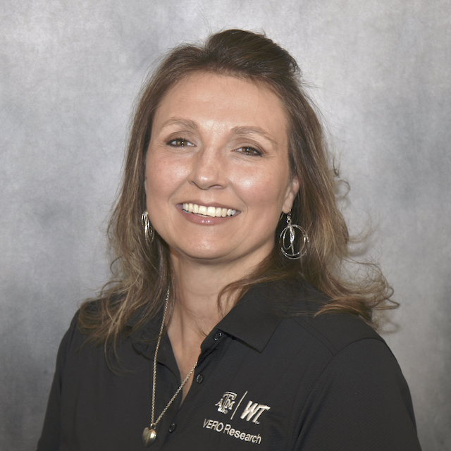
  

  

    <h2>Dana Burke</h2>
    <h3>-- Research Assistant</h3>
    
-- <a href="mailto:dburk@tamu.edu">dburk@tamu.edu</a> 
  

  

    
Dana was born and raised in Amarillo, TX and received her Bachelor of Science degree in Wildlife Biology from West Texas A&M University in 2004. She enjoys her job in the VERO Molecular Biology Research Laboratory as a Research Assistant. Dana spends her day in the lab using Next Generation Sequencing workflows such as Target Enrichment and 16S and helps Graduate students with their research whenever she is needed. She and her husband are parents of three wonderful children, grandparents to a beautiful granddaughter, and have two dogs and one cat.

  

    

--------
### Carter, Hannah  {:.invisible-header}

  

     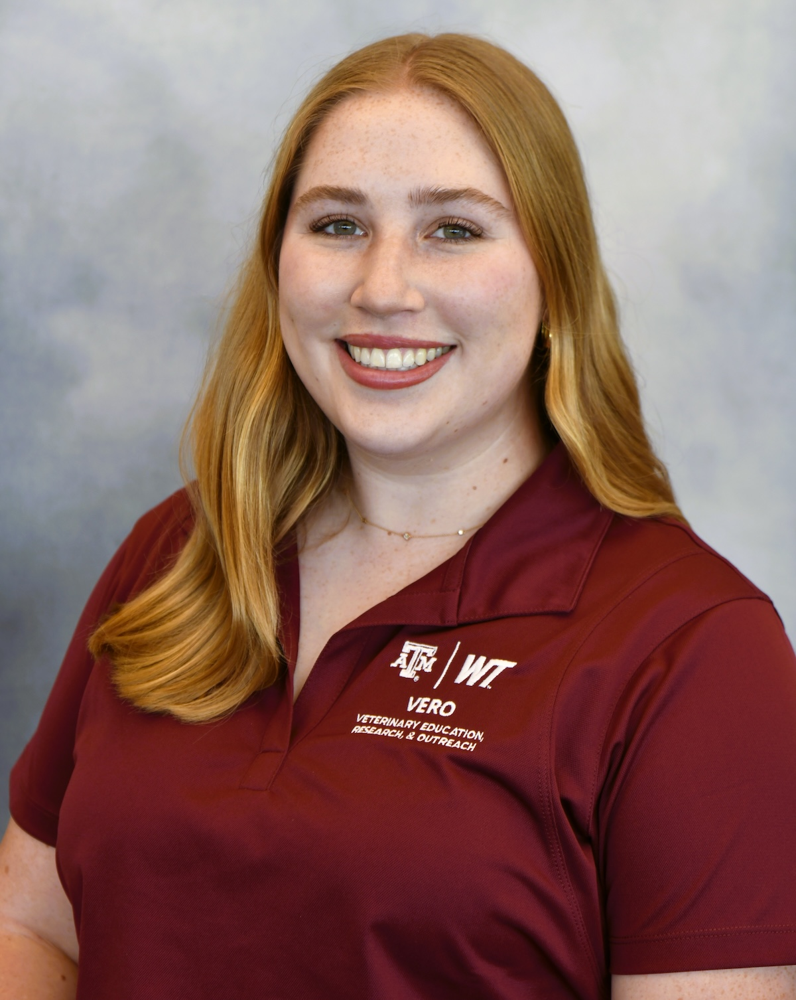
  

    

    <h2>Hannah Carter</h2>
    <h3>-- PhD Student, Texas A&M University 
    -- Advisor: Dr. Paul Morley</h3>
    
-- <a href="mailto:hlc5746@tamu.edu">hlc5746@tamu.edu</a> 
 

  

    
Hannah was born and raised in the Texas Hill Country on a beef cattle ranch.  She received her Bachelor of Science from Texas A&M University in 2024, majoring in Animal Science.  Her research focus will be characterization of the microbiome and resistome in production animals.

  

    
 
-------
### Dudley, Ethan  {:.invisible-header}

  

    
  

  

    <h2>Ethan Dudley</h2>
    <h3>-- PhD Student, Texas A&M University 
    -- Advisor: Dr. Robert Valeris-Chacin</h3>
    
-- <a href="mailto:edudley01@tamu.edu">edudley01@tamu.edu</a> 
 

  

    
Ethan was born and raised in Cartersville, Georgia, and earned his B.S. degree in Animal Science from Berry College in Rome, Georgia. He joined the Valeris lab at VERO in 2023 as a M.S. student in the Texas A&M Biomedical Science program. His research will focus on evaluating the distribution of virulence and antimicrobial resistance genes present in <i>Salmonella</i> isolates from Beef and Dairy Cattle in the Texas Panhandle, Colorado, and Western New Mexico. Better characterization of <i>Salmonella</i> pathogenesis and epidemiology and its association with illness in cattle will allow the industry to better understand and mitigate the harm caused by Salmonella.

  

    

-------
   ### Erickson, Sarah  {:.invisible-header}

  

     
  

    

    <h2>Sarah Erickson</h2>
    <h3>-- PhD Student, Texas A&M University 
    -- Advisor: Dr. Paul Morley</h3>
    
-- <a href="mailto:serickson@tamu.edu">serickson@tamu.edu</a> 
 

  

    
Sarah Erickson is currently pursuing her Doctor of Philosophy (Biomedical Sciences) through the VERO program at Texas A&M University in Canyon, Texas. Sarah received her Master of Science (2023) from the University of Saskatchewan in Saskatoon, Saskatchewan, Canada, and her Bachelor of Science (2018) from the University of Alberta in Edmonton, Alberta. The area of focus for Sarah's MSc thesis was the epidemiology of hoof-related lameness in western Canadian feedlot cattle. Sarah became part of the Feedlot Health Management Services team in 2018. In 2020, Sarah became part of the TELUS Agriculture team and currently works on the Animal Health Support Team as a data advisor.Hannah was born and raised in the Texas Hill Country on a beef cattle ranch.  She received her Bachelor of Science from Texas A&M University in 2024, majoring in Animal Science.  Her research focus will be characterization of the microbiome and resistome in production animals.

  

    
 
-------
### Hacker, Nicholas  {:.invisible-header}

  

    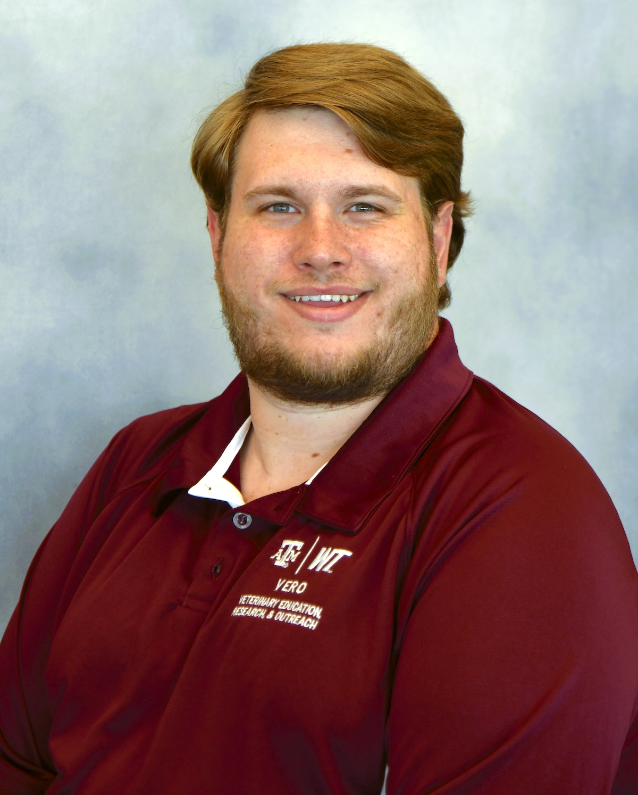
  

  

    <h2>Nicholas Hacker</h2>
    <h3>-- MS Student, Texas A&M University 
    -- Advisor: Dr. Robert Valeris-Chacin</h3>
    
-- <a href="mailto:nhacker@tamu.edu">nhacker@tamu.edu</a> 
 

  

    
Nicholas is a graduate research assistant under Dr. Valeris-Chacin. He graduated from West Texas A&m with a BS in wildlife biology and is pursuing his master's at TAMU VERO.  His goal is to pursue the wildlife/agriculture interface to help develop new interventions to benefit human and animal health.

  

    

-------
### Hazlett, Kayla  {:.invisible-header}

  

    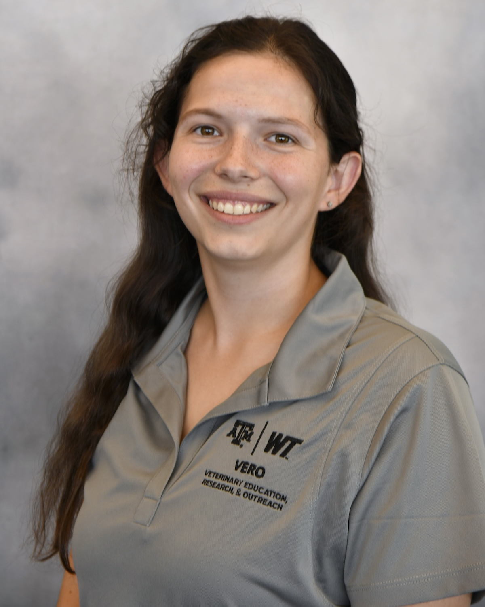
  

  

    <h2>Kayla Hazlett</h2>
    <h3>-- PhD Student, Texas A&M University 
    -- Advisor: Dr. Lee Pinnell</h3>
    
-- <a href="mailto:kayla.hazlett@tamu.edu">kayla.hazlett@tamu.edu</a> 
 

  

    
Kayla is originally from Woodstock, Georgia and earned her Bachelor of Science degree in Animal Science from Berry College in Rome, Georgia.  She joined VERO in 2024 as a Ph.D student in the Texas A&M Biomedical Sciences (BIMS) program.  Her research will focus on using shotgun metagenomic and 16S rRNA amplicon sequencing data to investigate the microbial communities associated with bovine liver abscesses.  Outside of work, Kayla enjoys spending time outdoors and with her cat Fish Stik. 

  

    

--------
### Hunt, Brennen  {:.invisible-header}

  

    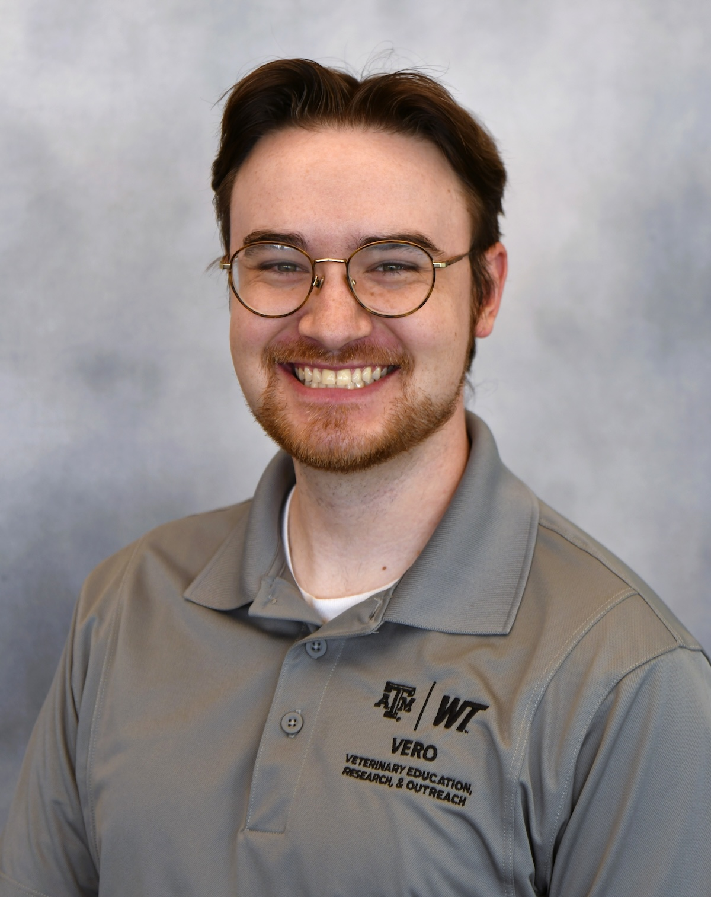
  

  

    <h2>Brennen Hunt</h2>
    <h3>-- MS Student, Texas A&M University 
    -- Advisor: Dr. Paul Morley </h3>
    
-- <a href="mailto:brennonohunt@tamu.edu">brennonohunt@tamu.edu</a> 
 

  

    
 Brennen was born in Manchester, CT, moved to Albuquerque, NM when he was eight, then moved again to Mesa, AZ when he was 13.  He graduated from the University of Arizona with a bachelor's degree in microbiology and a minor in classics.  He worked in a clinical microbiology lab at a medical center in Tucson, AZ for two years examining patient specimens for bacteria, fungi and parasites.  He frequently encountered multi drug resistant or totally drug resistant organisms, which prompted and interest in studying antibiotic reistance in microorganisms.  Having experienced the clinical side of microbiology, he hopes to combine his past work with his future studies in a research lab in order to gain a more complete understanding of human and animal health.

  

    

--------
### Jones, Jaye  {:.invisible-header}

  

    
  

  

    <h2>Jaye Jones</h2>
    <h3>-- Administrative Coordinator</h3>
    
-- <a href="mailto:jayejones@tamu.edu">jayejones@tamu.edu</a> 
 

  

    
Jaye Jones is an administrative coordinator for VERO through the Department of Large Animal Clinical Sciences (VLCS) in the College of Veterinary Medicine & Biomedical Sciences (CVMBS). She holds a degree in business administration from New Mexico State University and brings over twenty-five years of experience in university systems and agricultural organizations to her role, having served as both an executive director and an administrator. Jaye is married to Mark, and they have a spoiled rotten Australian cattle dog named Sophie.

  

    

--------
### Lamsal, Kushal (Sal) {:.invisible-header}

  

    
  

  

    <h2>Kushal (Sal) Lamsal</h2>
    <h3>-- MS Student, Texas A&M University  
    -- Advisor: Dr. Robert Valeris-Chacin
    
-- <a href="mailto:sal@tamu.edu">sal@tamu.edu</a> 
  

  

    
 Kushal “Sal” Lamsal was born and raised in the Kirtipur Valley in the highlands of Kathmandu, Nepal (GO RHINOS!!). He received his Bachelor’s degree in Biochemistry from West Texas A&M University (GO BUFFS!!) in Canyon, Texas. In September 2022, he joined the VERO lab as an Undergraduate Research Assistant and worked in that position until July 2023. In the fall of 2023, he began his Graduate Research Assistantship at VERO (GIG’EM) under Dr. Robert Valeris-Chacin. His MS thesis focuses on the design, optimization, and validation of targeted-enriched metagenomics to obtain strain-level data for Mycoplasma bovis in respiratory samples from cattle. Besides research, he is also involved in the Graduate Student Association as the Travel Award Secretary, where he organizes events to engage other graduate students with fun activities and nutritious lunches. During his free time, he enjoys reading books, learning new things, and working on his ROKR Classic City Tram LK801 model.

  

    

    -------
   ### Lugo Mesa, Valeria {:.invisible-header}

  

    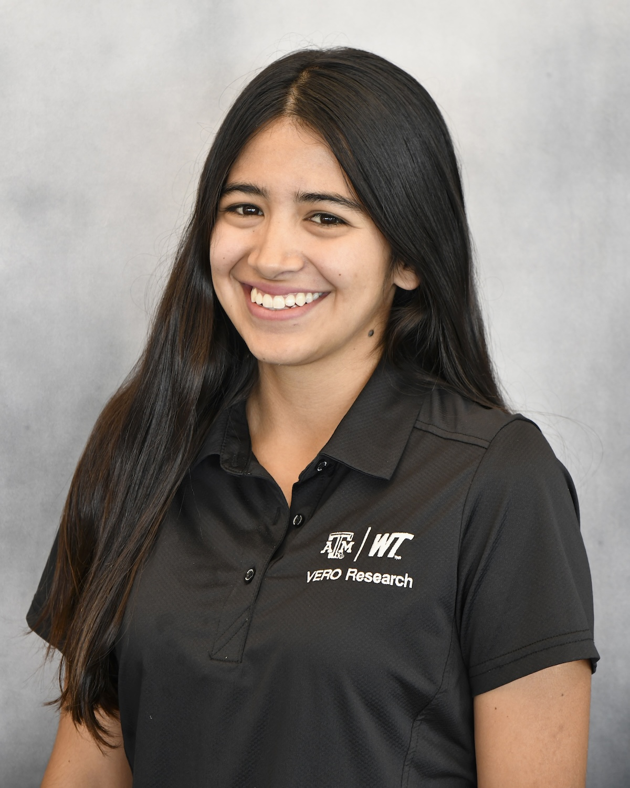
  

  

    <h2>Valeria Lugo Mesa</h2>
    <h3>-- MS Student, Texas A&M University 
    -- Advisor: Dr. Lee Pinnell</h3>
    
-- <a href="mailto:valerialugo@tamu.edu">valerialugo@tamu.edu</a> 
 

  

    
Valeria is originally from Bogota, Colombia, and earned her DVM from Universidad Nacional de Colombia in 2023. After an intership at the Universityof Minnesota, she joined the VERO team in 2024 as a M.S. student in the Texas A&M Biomedical Sciences program.  Her research focuses on microbial ecology and antimicrobial resistance across diverse environments and hosts.  Her professional interests include using computational approaches and data visualization to answer biological questions.  Outside of work, she enjoys spending time outdoors, especially by a lake on a hot summer day.

  

    
 
--------
### McAllister, Hudson  {:.invisible-header}

  

    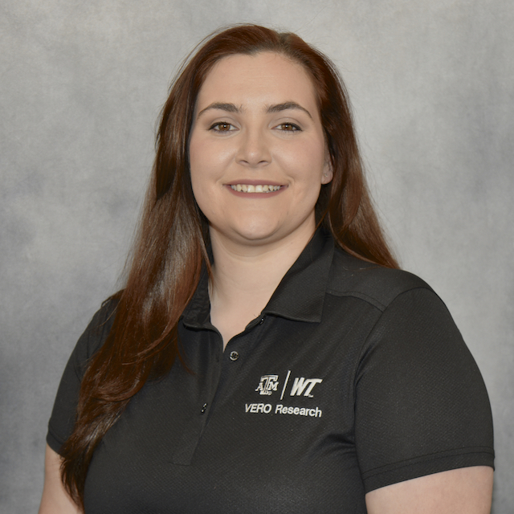
  

  

    <h2>Hudson McAllister, MS</h2>
    <h3>-- PhD Student, Texas A&M University 
    -- Advisor: Dr. Matthew Scott</h3>
    
-- <a href="mailto:hmcallister15@tamu.edu">hmcallister15@tamu.edu</a> 
 

  

    
Hudson is originally from western North Carolina and attended the University of Tennessee at Martin for her BS in Agriculture in 2019. She received her MS degree in Animal Science from West Texas A&M University in 2021, where she focused on the effect of intranasal or parental respiratory vaccines administered on arrival or delayed in auction-derived heifers. Her doctoral research focus is in understanding how management decisions affect long-term outcomes, including cattle health and performance. Her professional interests include epidemiology, immunology, vaccines, bovine respiratory disease, and veterinary biologics. Upon completion of her doctoral work, she aims to lead and develop research and outreach programs within the animal health industry related to pharmaceuticals.

  

    

--------
### McClurg, Molly  {:.invisible-header}

  

    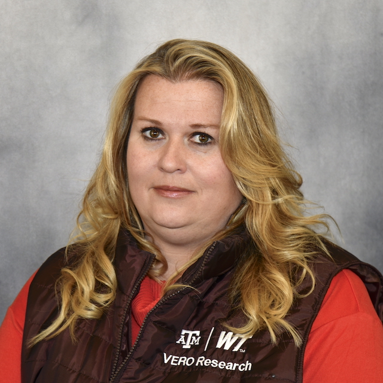
  

  

    <h2>Molly McClurg</h2>
    <h3>-- PhD Student, Texas A&M University 
    -- Advisors: Dr. Paul Morley and Dr. Keri Norman</h3>
  

  

    
Molly received her undergraduate and MS degree from Texas A&M University-Kingsville in Biological Sciences. Her research focus was the microbiome of wild-caught rodents and raccoons, with an interest in GI tract variability, pathogens, and antibiotic resistance. Her doctoral research theme focuses on characterizing the microbiome and resistome of feedlot cattle, beef products, and human consumers of beef products.

    
-- <a href="https://www.ncbi.nlm.nih.gov/myncbi/1TWy6qemt87sOY/bibliography/public/">PubMed bibliography link</a>

  

    

--------
### Murphy, Maggie  {:.invisible-header}

  

    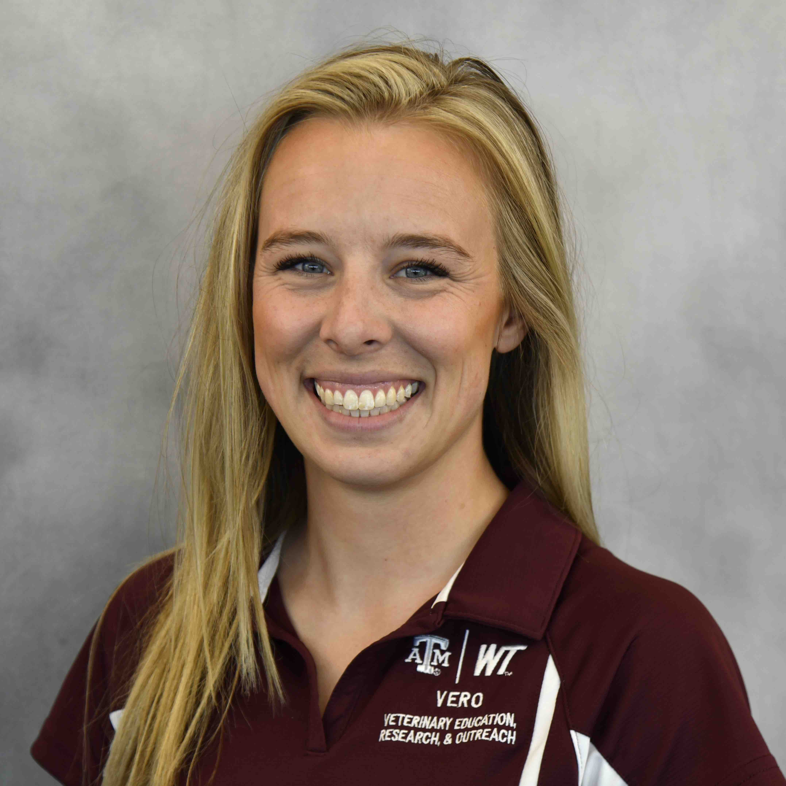
  

  

    <h2>Maggie Murphy</h2>
    <h3>-- PhD Student, West Texas A&M University 
    -- Advisors: Dr. Paul Morley and Dr. John Pipkin</h3>
    
-- <a href="mailto:mmurphy@wtamu.edu">mmurphy@wtamu.edu</a> 
  

  

    
Maggie grew up in Peyton, Colorado before moving to Canyon, TX to pursue her B.S. in Equine Industry and Business at West Texas A&M University.  following this, Maggie also pursued her M.S. in Animal Science at WT working under Dr. Lance Baker and Dr. John Pipkin, researching voluntary dry matter intake of equines being fed a functional feed additive.  Currently, Maggie is working under Dr. Paul Morley on her Ph.D. in systems Agriculture through WTAMU.  Her research focuses on characterizing the developing microbiomes and resisitomes in young dairy cattle and young horses.  In her spare time, she enjoys horseback riding and spending time with her border collie. ....

  

    

--------
### Oyervides, Fabiola {:.invisible-header}

  

    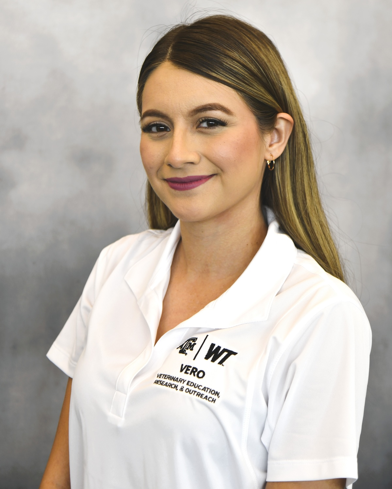
  

  

    <h2>Fabiola Oyervides</h2>
    <h3>-- PhD Student, Texas A&M University 
    -- Advisors: Dr. Lee Pinnell </h3>
    
-- <a href="mailto:foyervides@tamu.edu">foyervides@tamu.edu</a> 
  

  

    
Fabiola completed her bachelor's degree in Animal Science with a Pre-Veterinary focus and a master's degree in Chemistry from Texas A&M University-Kingsville.  Her research interests include epidemioogy, immunology, and veterinary medicine. 

  

    

--------
### Prosser, Haleigh  {:.invisible-header}

  

    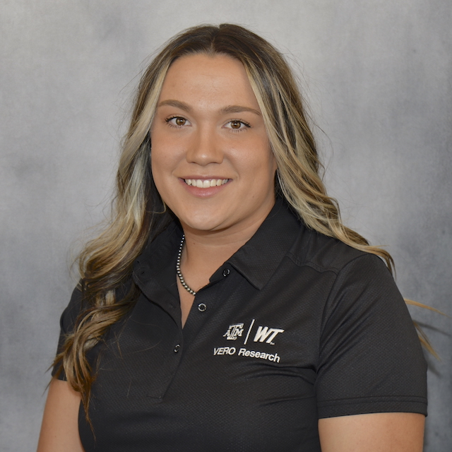
  

  

    <h2>Haleigh Prosser</h2>
    <h3>-- PhD Student, Texas A&M University 
    -- Advisor: Dr. Matthew Scott</h4>
    
-- <a href="mailto:hmprosser1@buffs.wtamu.edu">hmprosser1@buffs.wtamu.edu</a> 
  

  

    
Haleigh received her Bachelor of Science in Animal Sciences in 2021 and her M.S. in Animal Sciences, both from West Texas A&M University. She is currently a PhD student, focusing on the application of genomic technologies in the commercial cattle feedlot industry. Her prominent cattle feeding background has shaped her goals and guided her research to focus on the genetic quality of fed cattle. Her current project includes analyzing prospectively pooled genotypes and evaluating their economic efficiency.

  

    

--------
### Ramirez, Bradly  {:.invisible-header}

  

    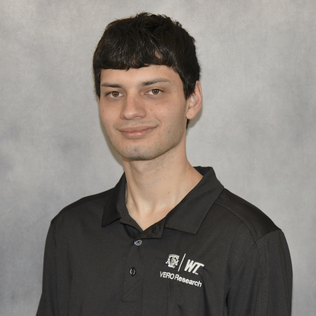
  

  

    <h2>Bradly Ramirez</h2>
    <h3>-- PhD Student, Texas A&M University 
    -- Advisor: Dr. Matthew Scott</h3>
    
-- <a href="mailto:ramirez_b@tamu.edu">ramirez_b@tamu.edu</a> 
  

  

    
Bradly completed his undergraduate degree at the University of Houston-Victoria in 2021. He is currently a PhD student in the Biomedical Sciences (BIMS) program at VERO. His research focuses on the transcription and methylation of immunologically important genes, specifically in the context of bovine respiratory disease. By studying how cattle gene expression changes in response to stress, handling, and pharmaceuticals, especially in the context of disease, he hopes to detail new etiologies of multifactorial diseases in cattle. His other interests involve gene therapy, and its potential to translate research on gene expression into tangible benefits, for individuals afflicted by congenital disorders.

  

    

--------
### Reyes, Ember  {:.invisible-header}

  

    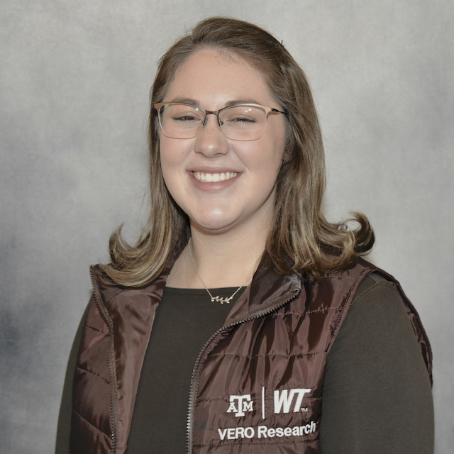
  

  

    <h2>Ember Reyes</h2>
    <h3>-- Student Research Assistant</h3>
  

  

    
Ember is an undergraduate student at West Texas A&M University, earning her Bachelor's of Science in Animal Science with a Pre-Veterinary focus. Her current aim, after completing veterinary school either within the United States or internationally, is to serve as a veterinarian for a guide dog organization. This will allow her to continue executing on her passion for clinical veterinarian practices, training service animals, and conducting research within the fields of canine genetics, breeding and behavior for guide dogs. Ember is currently working as a VERO Research Lab Assistant - Student Worker in the VERO Molecular Biology Lab with a focus on DNA extractions. 

  

    

--------
### Tamm, Stephen  {:.invisible-header}

  

    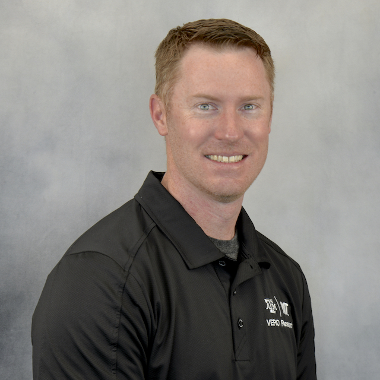
  

  

    <h2>Stephen Tamm, MS</h2>
    <h3>-- MS Student 
    -- Advisor: Dr. Paul Morley</h3>
    
-- <a href="mailto:sctamm@tamu.edu">sctamm@tamu.edu</a> 
   -- <a href="https://www.ncbi.nlm.nih.gov/myncbi/1jmFD_nAPdeE_a/bibliography/public/">PubMed bibliography link</a> 
  

  

    
Stephen completed undergraduate studies in animal science at West Texas A&M University in 2012 and immediately began work in animal nutrition and feedlot services throughout Texas, New Mexico, Kansas, and Oklahoma.  He later relocated to Idaho to expand his education and received his MS from the University of Idaho in 2018.  His research at UI was focused on cell signaling and bovine skeletal muscle satellite cell behavior.  Stephen also held a teaching assistantship and advised pre-veterinary undergraduate students while at UI.  His current interests include physiological mechanisms in agricultural production systems, microbiome dynamics and anatomical axes, and epidemiological perspectives on sustainable agriculture.  He joined #TeamVERO in 2022 and is conducting research focused on pathogen monitoring in beef production systems, microbial predictors of animal health, and antimicrobial resistance dynamics in large animals.

  

    

--------
### Torres, Luis  {:.invisible-header}

  

    
  

  

    <h2>Luis Torres</h2>
    <h3>-- PhD Student </h3>
    
-- <a href="mailto:luisalfredotorres@tamu.edu">luisalfredotorres@tamu.edu</a> 
    -- <a href="https://www.ncbi.nlm.nih.gov/myncbi/1ZM7OW8ekJmAeh/bibliography/public/">PubMed bibliography link</a> 
  

  

    
Luis Torres is a DVM who graduated from the Universidad Autónoma de Ciudad Juárez (2016). He currently holds a full-time position at TELUS Ag, formerly Feedlot Health Management Services, based in the Amarillo office, where he has been working for the past 8 years. Concurrently, he is pursuing a Doctor of Philosophy (Biomedical Sciences) through West Texas A&M University in Canyon Texas.

  
  

-------
### Wolfe, Cory  {:.invisible-header}

  

    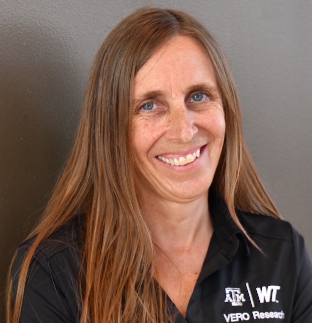
  

  

    <h2>Cory Wolfe</h2>
    <h3>-- Research Associate and VERO Laboratory Manager </h3>
    
-- <a href="mailto:cawolfe@tamu.edu">cawolfe@tamu.edu</a> 
    -- <a href="https://www.ncbi.nlm.nih.gov/myncbi/1ZM7OW8ekJmAeh/bibliography/public/">PubMed bibliography link</a> 
  

  

    
Cory is a molecular biologist that oversees and manages activities in the VERO Research Laboratory.

  
  

  --------
 
## [Former VERO TEAM Members](formerteammembers.md)
  

