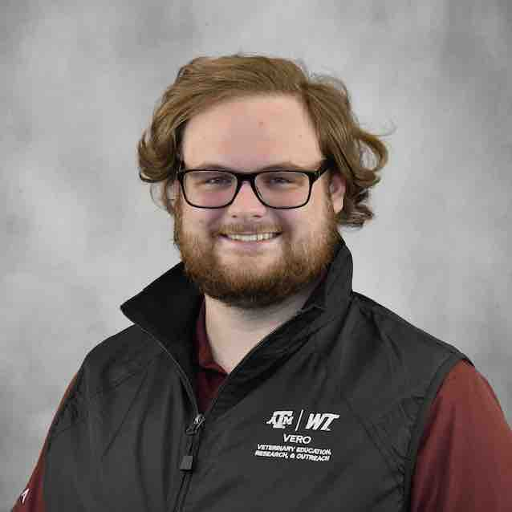

# <b>Students and Staff</b>
## (alphabetical order)
--------
### Bechtol, Nerissa  {:.invisible-header}

  

    
  

  

    <h2>Nerissa Bechtol Wuest</h2>
    <h3>-- Research Assistant</h3>
    
-- <a href="mailto:nbechtol@tamu.edu">nbechtol@tamu.edu</a> 
    

  

    
Nerissa Bechtol received her BSc. from the University of Amsterdam in 2020. She began working at the VERO Research Lab in 2022. Prior to working in the lab she worked on a research feedlot in Canyon, TX, and as a veterinary technician in Santa Fe, NM. She will be attending Texas A&M School of Veterinary Medicine Class of 2027. Her areas of interest include production animal health and internal medicine. Outside of work, Nerissa enjoys spending time with her horse, Daisy and three-legged cat, Troubadour.

  

-------- 
### Burke, Dana  {:.invisible-header}

  

    
  

  

    <h2>Dana Burke</h2>
    <h3>-- Research Assistant</h3>
    
-- <a href="mailto:dburk@tamu.edu">dburk@tamu.edu</a> 
  

  

    
Dana was born and raised in Amarillo, TX and received her Bachelor of Science degree in Wildlife Biology from West Texas A&M University in 2004. She enjoys her job in the VERO Molecular Biology Research Laboratory as a Research Assistant. Dana spends her day in the lab using Next Generation Sequencing workflows such as Target Enrichment and 16S and helps Graduate students with their research whenever she is needed. She and her husband are parents of three wonderful children, grandparents to a beautiful granddaughter, and have two dogs and one cat.

  

--------
### Chung, Max  {:.invisible-header}

  

    
  

  

    <h2>Max Chung</h2>
    <h3>-- MS Student, Texas A&M University 
    -- Advisor: Dr. Robert Valeris-Chacin</h3>
    
-- <a href="mailto:chunmn26@tamu.edu">chunmn26@tamu.edu</a> 
  

  

    
Max received his BS in Biology from the University of Wisconsin - Green Bay in 2021. He joined Dr. Valeris’s lab in 2022 and is currently a Masters - Thesis student in the Biomedical Sciences (BIMS) program. Max’s research focuses on identifying virulence factors and antimicrobial resistance genes in <i>Salmonella</i> isolates from beef cattle in the Texas panhandle. By comparing the distribution of these pathogenicity-relevant genes among isolates, Max will advance the current knowledge on Salmonella ecology in cattle and significantly improve industry understanding of <i>Salmonella</i> capabilities to cause harm.

  

--------
### Dudley, Ethan  {:.invisible-header}

  

    
  

  

    <h2>Ethan Dudley</h2>
    <h3>-- MS Student, Texas A&M University 
    -- Advisor: Dr. Robert Valeris-Chacin</h3>
    
-- <a href="mailto:edudley01@tamu.edu">edudley01@tamu.edu</a> 
 

  

    
Ethan was born and raised in Cartersville, Georgia, and earned his B.S. degree in Animal Science from Berry College in Rome, Georgia. He joined the Valeris lab at VERO in 2023 as a M.S. student in the Texas A&M Biomedical Science program. His research will focus on evaluating the distribution of virulence and antimicrobial resistance genes present in <i>Salmonella</i> isolates from Beef and Dairy Cattle in the Texas Panhandle, Colorado, and Western New Mexico. Better characterization of <i>Salmonella</i> pathogenesis and epidemiology and its association with illness in cattle will allow the industry to better understand and mitigate the harm caused by Salmonella.

  

--------
### Hawkins, Jaye  {:.invisible-header}

  

    
  

  

    <h2>Jaye Hawkins</h2>
    <h3>-- Administrative Coordinator</h3>
    
-- <a href="mailto:jehawkins@tamu.edu">jehawkins@tamu.edu</a> 
 

  

    
Jaye Hawkins is an administrative coordinator for VERO through the Department of Large Animal Clinical Sciences (VLCS) in the CVMBS. She has a degree in business administration from New Mexico State University and more than twenty-five years of experience working within university systems and agricultural organizations serving as an executive director and administrator. She has adult twin daughters that are currently pursuing advanced degrees at Texas A&M and Texas Tech University and an awesome son-in-law. She loves dogs and has an Australian cattle dog named Sophie (best girl dog ever) and two grand-dogs, Charlie and Nellie. 

  

--------
### Huff, Rachel  {:.invisible-header}

  

    
  

  

    <h2>Rachel Huff</h2>
    <h3>-- Research Assistant</h3>
    
-- <a href="mailto:rphuff@tamu.edu">rphuff@tamu.edu</a> 
  

  

    
Rachel grew up on a cattle ranch in the Texas Panhandle, and from a young age was passionate about Animal Science. She received her Bachelor of Science from West Texas A&M University in 2021, majoring in Animal Science. Rachel started working at the VERO research lab as a student worker in September 2021. After graduation, she started a full-time position as a research assistant. Outside of work Rachel enjoys spending time outdoors with her Toy Australian Shepherd, Zeus and her Miniature Australian Shepherd, Oakley.

  

--------
### Lamsal, Kushal (Sal) {:.invisible-header}

  

    
  

  

    <h2>Kushal (Sal) Lamsal</h2>
    <h3>-- Research Assistant</h3>
    
-- <a href="mailto:sal@tamu.edu">sal@tamu.edu</a> 
  

  

    
Sal is a senior Undergraduate Biology/Biochemistry student who works at the VERO research lab as a student research assistant. Born and raised in Kathmandu, Nepal, he now calls Long Island, New York his home. During free time he enjoys reading and learning new things.

  

--------
### McAllister, Hudson  {:.invisible-header}

  

    
  

  

    <h2>Hudson McAllister, MS</h2>
    <h3>-- PhD Student, Texas A&M University 
    -- Advisor: Dr. Matthew Scott</h3>
    
-- <a href="mailto:hmcallister15@tamu.edu">hmcallister15@tamu.edu</a> 
 

  

    
Hudson is originally from western North Carolina and attended the University of Tennessee at Martin for her BS in Agriculture in 2019. She received her MS degree in Animal Science from West Texas A&M University in 2021, where she focused on the effect of intranasal or parental respiratory vaccines administered on arrival or delayed in auction-derived heifers. Her doctoral research focus is in understanding how management decisions affect long-term outcomes, including cattle health and performance. Her professional interests include epidemiology, immunology, vaccines, bovine respiratory disease, and veterinary biologics. Upon completion of her doctoral work, she aims to lead and develop research and outreach programs within the animal health industry related to pharmaceuticals.

  

--------
### McClurg, Molly  {:.invisible-header}

  

    
  

  

    <h2>Molly McClurg</h2>
    <h3>-- PhD Student, Texas A&M University 
    -- Advisors: Dr. Paul Morley and Dr. Keri Norman</h3>
  

  

    
Molly received her undergraduate and MS degree from Texas A&M University-Kingsville in Biological Sciences. Her research focus was the microbiome of wild-caught rodents and raccoons, with an interest in GI tract variability, pathogens, and antibiotic resistance. Her doctoral research theme focuses on characterizing the microbiome and resistome of feedlot cattle, beef products, and human consumers of beef products.

    
-- <a href="https://www.ncbi.nlm.nih.gov/myncbi/1TWy6qemt87sOY/bibliography/public/">PubMed bibliography link</a>

  

--------
### Murphy, Maggie  {:.invisible-header}

  

    
  

  

    <h2>Maggie Murphy</h2>
    <h3>-- PhD Student, West Texas A&M University 
    -- Advisors: Dr. Paul Morley and Dr. John Pipkin</h3>
    
-- <a href="mailto:mmurphy@wtamu.edu">mmurphy@wtamu.edu</a> 
  

  

    
Maggie received her undergraduate and MS degree from West Texas A&M University. Her research focus ....

  

--------
### Panaretos, Chris  {:.invisible-header}

  

    
  

  

    <h2>Chris Panaretos</h2>
    <h3>-- PhD Student, Texas A&M University 
    -- Advisor: Dr. Robert Valeris-Chacin</h3>
  

  

    
Chris is a cell biologist who is learning more about the use of computers to analyze biological data, i.e. bioinformatics. He is using bioinformatics tools to identify individual Mycoplasma bovis strains from cattle respiratory swab samples.

  

--------
### Prosser, Haleigh  {:.invisible-header}

  

    
  

  

    <h2>Haleigh Prosser</h2>
    <h3>-- PhD Student, Texas A&M University 
    -- Advisor: Dr. Matthew Scott</h4>
    
-- <a href="mailto:hmprosser1@buffs.wtamu.edu">hmprosser1@buffs.wtamu.edu</a> 
  

  

    
Haleigh completed her Bachelor of Science in Animal Science at West Texas A&M University in 2021. She is currently an MS student, focusing on the application of genomic technologies in the commercial cattle feedlot industry. Her prominent cattle feeding background has shaped her goals and guided her research to focus on the genetic quality of fed cattle. Her current project includes analyzing prospectively pooled genotypes and evaluating their economic efficiency.

  

--------
### Ramirez, Bradly  {:.invisible-header}

  

    
  

  

    <h2>Bradly Ramirez</h2>
    <h3>-- PhD Student, Texas A&M University 
    -- Advisor: Dr. Matthew Scott</h3>
    
-- <a href="mailto:ramirez_b@tamu.edu">ramirez_b@tamu.edu</a> 
  

  

    
Bradly completed his undergraduate degree at the University of Houston-Victoria in 2021. He is currently a PhD student in the Biomedical Sciences (BIMS) program at VERO. His research focuses on the transcription and methylation of immunologically important genes, specifically in the context of bovine respiratory disease. By studying how cattle gene expression changes in response to stress, handling, and pharmaceuticals, especially in the context of disease, he hopes to detail new etiologies of multifactorial diseases in cattle. His other interests involve gene therapy, and its potential to translate research on gene expression into tangible benefits, for individuals afflicted by congenital disorders.

  

--------
### Reyes, Ember  {:.invisible-header}

  

    
  

  

    <h2>Ember Reyes</h2>
    <h3>-- Student Research Assistant</h3>
  

  

    
Ember is an undergraduate student at West Texas A&M University, earning her Bachelor's of Science in Animal Science with a Pre-Veterinary focus. Her current aim, after completing veterinary school either within the United States or internationally, is to serve as a veterinarian for a guide dog organization. This will allow her to continue executing on her passion for clinical veterinarian practices, training service animals, and conducting research within the fields of canine genetics, breeding and behavior for guide dogs. Ember is currently working as a VERO Research Lab Assistant - Student Worker in the VERO Molecular Biology Lab with a focus on DNA extractions. 

  

--------
### Tamm, Stephen  {:.invisible-header}

  

    
  

  

    <h2>Stephen Tamm, MS</h2>
    <h3>-- PhD Student 
    -- Advisor: Dr. Paul Morley</h3>
    
-- <a href="mailto:sctamm@tamu.edu">sctamm@tamu.edu</a> 
   -- <a href="https://www.ncbi.nlm.nih.gov/myncbi/1jmFD_nAPdeE_a/bibliography/public/">PubMed bibliography link</a> 
  

  

    
Stephen completed undergraduate studies in animal science at West Texas A&M University in 2012 and immediately began work in animal nutrition and feedlot services throughout Texas, New Mexico, Kansas, and Oklahoma.  He later relocated to Idaho to expand his education and received his MS from the University of Idaho in 2018.  His research at UI was focused on cell signaling and bovine skeletal muscle satellite cell behavior.  Stephen also held a teaching assistantship and advised pre-veterinary undergraduate students while at UI.  His current interests include physiological mechanisms in agricultural production systems, microbiome dynamics and anatomical axes, and epidemiological perspectives on sustainable agriculture.  He joined #TeamVERO in 2022 and is conducting doctoral research focused on pathogen monitoring in beef production systems, microbial predictors of animal health, and antimicrobial resistance dynamics in large animals.

  

--------
### Wolfe, Cory  {:.invisible-header}

  

    
  

  

    <h2>Cory Wolfe</h2>
    <h3>-- Research Associate and VERO Laboratory Manager </h3>
    
-- <a href="mailto:cawolfe@tamu.edu">cawolfe@tamu.edu</a> 
    -- <a href="https://veroresearch.org">PubMed bibliography link</a> 
  

  

    
Cory is a molecular biologist that oversees and manages activities in the VERO Research Laboratory.

  

--------
### Young, James Daniel  {:.invisible-header}

  

    
  

  

    <h2>James Daniel Young, MS</h2>
    <h3>-- PhD Student, West Texas A&M University 
    -- Advisors: Dr. Paul Morley and Dr. John Richeson</h3>
    
-- <a href="mailto:jdyoung3@buffs.wtamu.edu">jdyoung3@buffs.wtamu.edu</a> 
    -- <a href="https://www.ncbi.nlm.nih.gov/myncbi/james.young.6/bibliography/public/">PubMed bibliography link</a>

  

  

    
Daniel received his MS degree from Texas Tech University in 2022, where he studied beef cattle nutrition. Daniel’s doctoral research is focused on gastrointestinal health of feedlot cattle. More specifically his research focuses on the interaction between the animal and gut microbiota. Daniel’s work aims to connect gastrointestinal health to complex diseases like liver abscesses, to better understand the pathogenesis and mitigation strategies of these diseases.

  

--------
## [Former Cast Members](formercastmembers.md)
  

